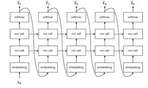

# Transformer

## Teacher Forcing 
RNN언어 모델은 Autoregressive 한 성격을 가지고 있어서 예측 할 때는 t시점의 아웃풋이 t+1시점의 인풋으로 들어간다. 하지만 훈련을 할 때에는 t+1시점의 인풋에 t시점의 아웃풋이 아니라 실제 정답을 넣어주며 학습하게 된다. 이것을 teacher forcing이라고 한다. 하지만 배울 때는 선생님 설명 들으면서 풀면 잘 풀리고 집에 가서 혼자 풀어보면 안 풀리는 것처럼 학습과 추론과정 사이에 괴리가 발생한다. 그래도 선생님 도움 없이 순수 혼자 공부하는 것 보다는 조금이라도 더 이해되듯이 성능도 조금이라도 더 좋다.  
  
추론할 때(Autoregressive)  
 
    

학습할 때(Non-Autoregressive)
 
    

## Sequence to Sequence 
 
     

- 인코더에서 받은 x를 최대한 보존하도록 압축을 수행하여 벡터로 만들고 그 벡터를 디코더에 보내 복원하는 오토인코더의 형태이고 Generator가 추가 되어있다.
- 인코더는 정답을 다 넣어주는 teacher forcing과 같은 형식이므로 nonautoregressive하다. 그러므로 bidirectional RNN 사용 가능하다.(뒤에거를 아니까)
- 디코더는 인코더로부터 받은 벡터를 가지고 문장을 만든다. 디코더는 미래를 알 수 없으므로 autoregressive이고 uni-directional RNN이다.
- Generator는 디코더로부터 각 타임스텝의 결과를 받아 softmax를 통해 가장 확률이 높은 단어를 반환한다.(softmax: 각 단어들이 나올 확률이라고 보면됨)

## Attention 
 
     

- 어텐션 기본 아이디어는 디코더에서 출력 단어를 예측하는 매 시점마다, 인코더에서 전체 입력 문장을 다시 한번 참고하라는 것이다. 다만, 모두 동일한 비율로 참고하는 것이 아니라, 해당 시점에서 예측해야 할 단어와 연관성 있는 입력 단어 부분을 좀 더 집중해서 본다.
- 예컨대 독일어 "Ich mochte ein bier"를 영어 "I'd like a beer"로 번역하는 모델을 만든다고 치자. 모델이 네 번째 단어인 'beer'를 예측할 때 'bier'에 주목하게 만들고자 한다. 어텐션 매커니즘의 가정은 인코더가 'bier'에 주목하게 만들고자 한다. 어텐션 매커니즘의 가정은 인코더가 'bier'를 받아서 벡터로 만든 결과(인코더 출격)는 디코더가 'beer'를 예측할 때 쓰는 벡터(디코더 입력)와 유사할 것 이라는 점이다.
- 쿼리(Query): t 시점의 디코더 아웃풋
- 키(Keys): 모든 시점의 인코더 아웃풋
- 벨류(Values): 모든 시점의 인코더 아웃풋
- Attention weight: softmax($h_t^{dec}$ * W * ${h_{1:m}}^{{enc}^T}$)하면 각 인코더 아웃풋에 대한 가중치가 나옴. 이때 가중치 각각의 값을 Attention weight라고 한다. 여기서 W는 gradient descent로 학습 시켜야 할 linear weight이다. 내적 연산이기 때문에 내적값이 클수록 cos 유사도가 커지는 것과 마찬가지이다. 그러므로 softmax를 씌우면 각 아웃풋들의 확률 분포가 나옴.
- LSTM을 쓰더라도 문장(시퀀스)이 너무 길어지면 한계가 있었는데 어텐션을 통해 더욱 긴 문장에도 대처할 수 있게 됨

# Attention is all you need

## Abstract 
기존에 성능이 좋은 모델들은 어텐션으로 연결된 인코더와 디코더를 포함한 RNN or CNN에 기반하는 모델이었다. RNN과 CNN을 제거하고 Attention만을 기반으로한 Transformer를 개발하였고 병렬화가 용이하고 훈련하는데 시간은 적게 드는데 성능은 더 좋았다. Transformer는 다른 task에서도 잘 일반화된다. train-set이 크고 제한된 둘 모두에서 작동을 잘한다.

## 1. Introduction 
RNN방식의 언어모델이 SOTA방법론으로 당연시 되었지만 직렬방식의 구조로 인해 훈련효율성, 기억유지의 한계 등이 있었다. 이를 보완하기 위한 다양한 시도가 있었지만 한계를 극복하지는 못했다. 또한 Attention모델은 언어 모델에서 뛰어난 성능을 보이지만 여전히 RNN과 같이 사용되었다. 그래서 병렬화를 위해 RNN을 제거하고 Attention만을 사용하는 Transformer를 제안한다.

## 2. Background 
시퀀스 연산을 줄이려는 목표가 있지만 CNN을 사용함으로써 서로 멀리 떨어져 있는 단어의 연관성을 배우는 것을 어렵게 만든다. Transformer에서는 attention-weight를 통해 연산수를 줄임. Self-attention은 시퀀스의 representation을 계산하기 위해 단일 시퀀스의 다른 포지션과 연관시킨다. end-to-end는 순환 시퀀스 대신 반복적인 attention을 기반으로 한다. Transformer는 RNN, CNN을 사용하지 않고 attention만을 이용한 최초의 모델이다.

## 3. Model Architecture
대부분 모델은 인코더-디코더 형태이다. Transformer는 인코더와 디코더가 완전히 연결된 self-attention과 점별로 쌓여있는 구조이다. 
 
     

 
     

### 3.1 Encodef and Decoder Stacks
* Encoder: 인코더는 6개의 층으로 구성되어 있고 각층은 multi-head-attention과 feed-forward(FFN) 2개의 서브층으로 나뉜다. 서브층에서는 residual connection과 layer normalization을 사용한다. 계산을 용이하게 하기 위해 각 서브층의 아웃풋 크기 $d_{model}=512$로 통일한다. 
* Decoder: 인코더와 마찬가지로 6개의 층으로 구성되어 있다. 2개의 서브층에 하나의 서브층이 추가되었고 인코더에서 받은 값을 multi-head-attention하는 역할을 한다. 기존 어텐션 모델에서 인코더-디코더 어텐션 역할을 한다. 디코더에서는 masking을 위해 서브층 한개를 변형했다. 마스킹을 함으로써 t위치의 예측이 t보다 작은 위치의 아웃풋에만 의존할 수 있게 해준다.

### 3.2 Attention
어텐션은 query와 key-value쌍이 output과 맵핑하는 것으로 묘사할 수 있다. output은 values의 weighted sum으로 계산되며, 여기서 각 value에 할당된 weight는 query와 해당 key의 compatibility function에 의해 계산된다.

 
     

#### 3.2.1 Scaled Dot-Product Attention
인풋은 쿼리, 키, 벨류이다. 벨류의 가중치를 얻고 벨류에 곱해준다. 계산은 다음과 같다. self-attention에서는 퀴리=키=벨류 이다.
 
     

쿼리와 키의 dot-product에서 ${d_k}^{1/2}$ 로만 나눠준 것이다. ${d_k}$ 가 너무 커지면 그레디언트가 너무 작아지므로 이를 방지하기 위해 루트를 씌워준다. 기존 어텐션과 마찬가지로 내적은 cos유사도를 의미한다. 유사도가 커질수록 cos값은 커지고 그걸을 softmax해주면 확률이 높아진다. 그것을 V에 곱해주면 유사할수록 높은 가중치를 곱하게 되어 비중이 커진다.

#### 3.2.2 Mult-Head Attention