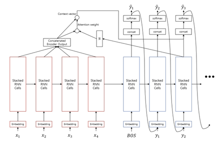

# Transformer

## Teacher Forcing 
RNN언어 모델은 Autoregressive 한 성격을 가지고 있어서 예측 할 때는 t시점의 아웃풋이 t+1시점의 인풋으로 들어간다. 하지만 훈련을 할 때에는 t+1시점의 인풋에 t시점의 아웃풋이 아니라 실제 정답을 넣어주며 학습하게 된다. 이것을 teacher forcing이라고 한다. 하지만 배울 때는 선생님 설명 들으면서 풀면 잘 풀리고 집에 가서 혼자 풀어보면 안 풀리는 것처럼 학습과 추론과정 사이에 괴리가 발생한다. 그래도 선생님 도움 없이 순수 혼자 공부하는 것 보다는 조금이라도 더 이해되듯이 성능도 조금이라도 더 좋다.  
  
추론할 때(Autoregressive)  
 
    

학습할 때(Non-Autoregressive)
 
    

## Sequence to Sequence 
 
     

- 인코더에서 받은 x를 최대한 보존하도록 압축을 수행하여 벡터로 만들고 그 벡터를 디코더에 보내 복원하는 오토인코더의 형태이고 Generator가 추가 되어있다.
- 인코더는 정답을 다 넣어주는 teacher forcing과 같은 형식이므로 nonautoregressive하다. 그러므로 bidirectional RNN 사용 가능하다.(뒤에거를 아니까)
- 디코더는 인코더로부터 받은 벡터를 가지고 문장을 만든다. 디코더는 미래를 알 수 없으므로 autoregressive이고 uni-directional RNN이다.
- Generator는 디코더로부터 각 타임스텝의 결과를 받아 softmax를 통해 가장 확률이 높은 단어를 반환한다.(softmax: 각 단어들이 나올 확률이라고 보면됨)

## Attention 
 
     

- 어텐션 기본 아이디어는 디코더에서 출력 단어를 예측하는 매 시점마다, 인코더에서 전체 입력 문장을 다시 한번 참고하라는 것이다. 다만, 모두 동일한 비율로 참고하는 것이 아니라, 해당 시점에서 예측해야 할 단어와 연관성 있는 입력 단어 부분을 좀 더 집중해서 본다.
- 예컨대 독일어 "Ich mochte ein bier"를 영어 "I'd like a beer"로 번역하는 모델을 만든다고 치자. 모델이 네 번째 단어인 'beer'를 예측할 때 'bier'에 주목하게 만들고자 한다. 어텐션 매커니즘의 가정은 인코더가 'bier'에 주목하게 만들고자 한다. 어텐션 매커니즘의 가정은 인코더가 'bier'를 받아서 벡터로 만든 결과(인코더 출격)는 디코더가 'beer'를 예측할 때 쓰는 벡터(디코더 입력)와 유사할 것 이라는 점이다.
- 쿼리(Query): t 시점의 디코더 아웃풋
- 키(Keys): 모든 시점의 인코더 아웃풋
- 벨류(Values): 모든 시점의 인코더 아웃풋
- Attention weight: softmax($h_t^{dec}$ * W * ${h_{1:m}}^{{enc}^T}$)하면 각 인코더 아웃풋에 대한 가중치가 나옴. 이때 가중치 각각의 값을 Attention weight라고 한다. 여기서 W는 gradient descent로 학습 시켜야 할 linear weight이다. 내적 연산이기 때문에 내적값이 클수록 cos 유사도가 커지는 것과 마찬가지이다. 그러므로 softmax를 씌우면 각 아웃풋들의 확률 분포가 나옴.
- LSTM을 쓰더라도 문장(시퀀스)이 너무 길어지면 한계가 있었는데 어텐션을 통해 더욱 긴 문장에도 대처할 수 있게 됨