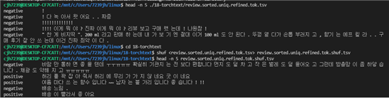
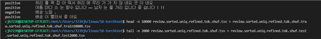

# Text Classification 
## NLP(Natural Language Processing)이란?  
● 자연어(Natural Language): 사람들이 일상적으로 쓰는 언어를 인공적으로 만들어진 언어인 인공어와 구분하여 부르는 개념  
● NLP: 사람이 이해하는 자연어를 컴퓨터가 이해할 수 있는 값으로 바꾸는 과정(NLU)과 컴퓨터가 이해할 수 있는 값을 사람이 이해하도록 바꾸는 과정(NLG)  

## NLP는 왜 어려운가?
● 중의성  
  ex) 눈에 눈이 들어갔다.  
● 문장 내 정보 부족으로 인한 모호함  
  ex) 나는 철수를 안 때렸다.  
  -> 철수는 맞았지만, 때린 사람이 나는 아니다.  
  -> 나는 누군가를 때렸지만, 그게 철수는 아니다.

## NLP Workflow
### 1. 문제정의  
* 단계를 나누고 simplify  
* x와 y를 정의  
  ex) x: 한국어 >> y: 영어  
### 2. 데이터수집  
* 구입, 외주  
  - 양질의 데이터를 얻을 수 있지만 양이 제한적이고 비용이 많이듬  
* 크롤링  
  - 양이 무제한이지만 품질이 천차만별이고 전처리 과정에 많은 노력이 필요  
### 3. 데이터전처리 및 분석  
  * 노이즈 제거
    - ex) '아 진짜 레알 짜증난다'에서 '레알' 삭제
    - Task, 언어에 따라 전처리 전략이 다름 
    - 정규식(Rwgular Expression)사용(VS코드에서 사용 가능)
    - 정규식을 사용할 경우, 규칙에 의해 노이즈를 제거하기 때문에 노이즈를 전부 제거하는 것은 어려움, 그러므로 적절한 합의점을 찾아야함  
     
         
  * 레이블링
    - Text Classification: 문장과 class 대응
    - Token Classification: 문장과 sequence 대응
    - Sequence-to-Sequence: 문장과 문장 대응
    - NLP에서는 각 row가 문장과 class, 문장과 문장이 tab으로 대응되는 TSV형태의 파일을 많이 씀  
     
           
  * 토큰화(Tokenization)
    - 단어들이 결합 되어있는 것을 쪼갬, 단어 숫자를 줄이고 희소성을 낮추기 위함
    - 특히 한국어는 접사가 붙고 띄어쓰기 통일이 안되어 있어 더 어려움을 겪음
    - 형태소 분석: Mecab, KoNLPy를 활용하여 형태소를 비롯하여, 어근, 접두사/접미사, 품사 등 다양한 언어 속성 구조 파악
    - 품사 태깅: 형태소의 뜻과 문맥을 고려하여 그것에 마크업을 하는 일  
     
           
    - 토큰의 길이가 짧을수록 단어크기 감소, OoV(단어가 데이터에 없어서 처리 못함) 줄어듬, Sequence길이가 길어짐
    - 토큰의 길이가 길수록 단어크기 증가, OoV늘어남, Sequence길이가 짧아짐   
     
        
        
  * 분절(Subword Segmentation)
    - 단어들을 더 작은 의미로 쪼갬, 세부단위로 나누면 OoV를 줄일 수 있다.
    - Ex) concentrate=con(together)+cent(center)+ate(make), 집중=집(모을 집)+중(가운데 중)
    - Byte Pair Encoding(BPE) 알고리즘  
      (1) BPE Training  
         a. 단어 사전 생성(빈도포함)  
         b. Character 단위로 분절 후, pair 별 빈도 카운트  
         c. 최빈도 pair를 골라, merge수행  
         d. Pair 별 빈도 카운트 업데이트  
         e. 과정 반복  
     
        
               
      (2) BPE Applying    
         a. 각 단어를 character 단위로 분절  
         b. 단어 내에서 '학습 과정에서 merge에 활용한 pair의 순서대로 merge 수행  
     
        
    - low:5, lower:2, newest:6, widest:3 의 단어가 있을 경우 lowest는 데이터에 없으므로 unk이 되므로 Oov발생, 하지만 분절을 수행하면 est가 학습이 되므로 unk이 안되므로 Oov 없앰
    - 한국어의 경우는 띄어쓰기가 제멋대로이므로 토큰화를 먼저 한 후에 분절 적용
    - BPE후 레이블 붙혀주기       
     
           
    - Detokenization
     
           
  * 미니배치(batchify)
    - 길이 차이 많이 나면 빈공간이 많은 부분 낭비 >> 계산 비효율

### 4. 알고리즘 적용
  * 데이터 셋을 전처리 후 shuffling 한다.
     
         
  * train_set과 test_set으로 나눈다. (본 학습은 train_set 10000개, test_set 2000개)
     
         
  * RNN과 CNN모델에 적용하여 학습하고 가장 좋은 모델(review.pth)을 저장한다.
     
         

### 5. 평가
  * 학습한 모델에 test_set을 적용하여 비교(10개중 1개만 틀림, 아주 적은 10000개만 학습했지만 성능 준수)
     
         

### 6. 배포
  * 실제 배포는 아니지만 테스트셋에 없는 문장을 적용해 봄(애매한 1개 빼고는 다 맞춤, 10000개만 학습한 것 치고는 좋은 결과)
     
         

## 나만의 감성모델
데이터 수집은 최대한 편견 없이 랭킹뉴스의 댓글과 유튜브의 댓글들을 수집했고 정치색이 심하게 들어간 데이터는 제외

  * 데이터 전처리(train set: 750, test set: 114)
     
         
  * 학습 
     
         
  * 테스트셋과 비교
     
         
  * 임의의 문장 적용
     
         

### 결론 
train set의 부족으로 인해 학습량이 부족하여 특정 단어에서만 잘 맞춘다. 김정일이나 국가보안법은 양쪽 레이블 모두에 자주 나오는 단어이므로 구분을 못하고 북조선은 특정 레이블에 자주 나타나는 단어이므로 구분을 한다. 그러므로 방대한 양의 데이터를 얻을 능력을 키워야함을 느꼈다. 또한, 댓글을 수집하면서 같은 문장이어도 기사의 제목에 따라 의미가 달라지는 경우가 많았다. 그러므로 기사의 제목 까지도 같이 훈련시켜서 의미를 구분할 수 있도록 하면 더 좋은 성능을 낼 수 있을 것 같다는 생각을 하였다. 그리고 이분류뿐만 아니라 다분류도 고려해볼 필요성을 느꼈다. 

